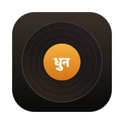
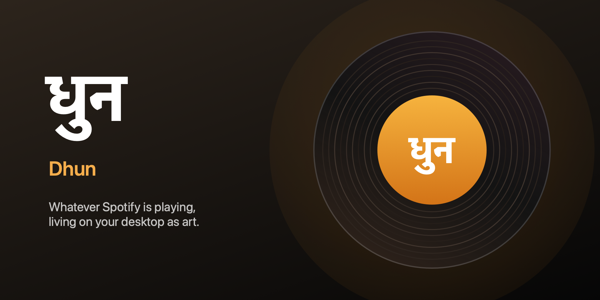

<div align="center">



# Dhun · धुन

**Whatever Spotify is playing, living on your desktop as art.**

*Dhun* (Hindi: धुन, "melody") is a tiny native macOS app — 100% Swift, AppKit + SwiftUI.
No Electron. No JavaScript. No web views.

[](https://github.com/Ayush-pbh/dhun/releases/latest)
[](https://github.com/Ayush-pbh/dhun/releases)


[](LICENSE)



**[⬇ Download Dhun.dmg](https://github.com/Ayush-pbh/dhun/releases/latest/download/Dhun-1.0.dmg)**

</div>

---

## What it does

Play something in Spotify. Dhun turns it into a piece of your desk:

🎨 **The floating square** — a borderless, chromeless window showing nothing but the
album art. Drag it anywhere. Double-click to open Spotify. Right-click for a quick menu.

💿 **Vinyl persona** — flip a switch and the square becomes a record that *actually
spins* while music plays (5–78 RPM, your call) and freezes on pause. Color it with five
curated duotones — or **Album colors**, which tints the grooves from the current cover.

🌈 **Palette everywhere** — Dhun extracts the dominant colors from every cover and
feeds them into an ambient glow behind the art, gradient wallpapers, and the vinyl tint.

🖼️ **Wallpaper mode** — the album art becomes your desktop background on every track
change: centered on blurred art, full-bleed, or a palette gradient.

🌀 **Live vinyl desktop** — a record rendered *above* your wallpaper but *below* your
desktop icons, spinning while music plays. A wallpaper that moves.

🏝️ **Notch island** — glide your pointer to the camera and an island expands with
artwork, live progress, and playback controls.

✨ **Moments** — a brief toast on track change, and a full-screen **Ambient mode**
(drifting blurred backdrop, sharp cover, big type) for when the Mac is docked.

📊 **Audio-reactive visualizer** — WMP-nostalgia spectrum bars or an oscilloscope
waveform in Ambient mode, driven by Spotify's *actual audio* (ScreenCaptureKit +
Accelerate FFT, filtered to Spotify's output only) and tinted with the album palette.
Needs the screen & system audio recording permission — never touches the microphone.

🕹️ **Controls where you want them** — hover the square for a **Liquid Glass** control
pill (macOS 26), scroll on it for volume, or use the menu bar item.

🫥 **Quiet by design** — optional click-through mode, invisible-to-screen-sharing mode,
hideable Dock icon, launch at login. Everything is a toggle in **Settings (⌘,)**.

## Install

1. **[Download Dhun-1.0.dmg](https://github.com/Ayush-pbh/dhun/releases/latest/download/Dhun-1.0.dmg)**
2. Open it and drag **Dhun** into **Applications**.
3. First launch: **right-click → Open** (Dhun is not notarized yet, so plain
   double-click will be blocked by Gatekeeper the first time).
4. Approve the **Automation** prompt — that's how Dhun reads the current track from
   Spotify. (Changed your mind later? System Settings → Privacy & Security →
   Automation → Dhun → Spotify.)

Needs macOS 13+ and the [Spotify desktop app](https://www.spotify.com/download/mac/) —
the web player is not scriptable.

## Build from source

```sh
git clone https://github.com/Ayush-pbh/dhun.git
cd dhun
./build.sh
open build/Dhun.app
```

Build with `build.sh` rather than `swift run` — macOS ties the automation permission to
the app bundle. To hack on it in Xcode, just open `Package.swift`.

Regenerate the icon or banner after tweaking the scripts:

```sh
swift scripts/make-icon.swift && iconutil -c icns build/AppIcon.iconset -o Dhun.icns
swift scripts/make-banner.swift
```

## How it works

- **`SpotifyController`** talks to the Spotify app over Apple events: current track,
  artwork URL, playback position, and commands (play/pause/next/previous/volume). It
  never launches Spotify — it only queries when Spotify is already running.
- **`PaletteExtractor`** downsamples each cover to 32×32 and scores quantized color
  clusters by frequency × vibrancy.
- **`VinylLayer`** is one Core Animation record shared by the square and the desktop
  scene; rotation pauses and resumes via layer time manipulation, and speed changes
  rebuild the animation from the current angle so the disc never jumps.
- **`WallpaperManager`** renders per-screen wallpapers with Core Image into
  `~/Library/Application Support/Dhun/Wallpapers/` and applies them with
  `NSWorkspace.setDesktopImageURL`.
- The notch island, toast, ambient scene, and desktop vinyl are independent borderless
  windows driven by one shared `NowPlayingModel`.

## Roadmap

- Album wall — listening-history collage wallpaper
- Cassette & CD personas
- Shortcuts / App Intents automation
- Developer ID signing + notarization

## License

[MIT](LICENSE) — © 2026 Ayush Tripathi.

<div align="center">
<sub>Dhun is an independent project and is not affiliated with or endorsed by Spotify.</sub>
</div>
